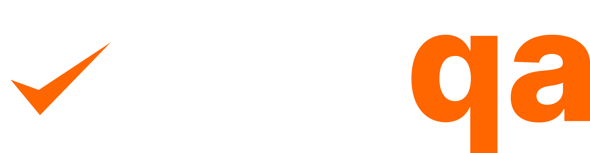
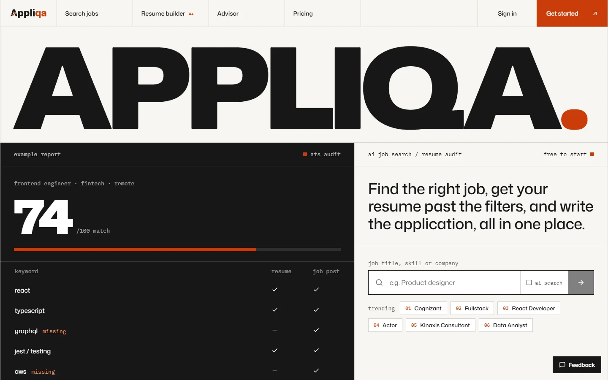
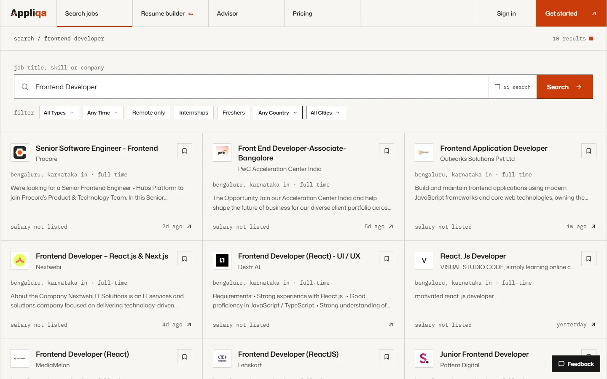
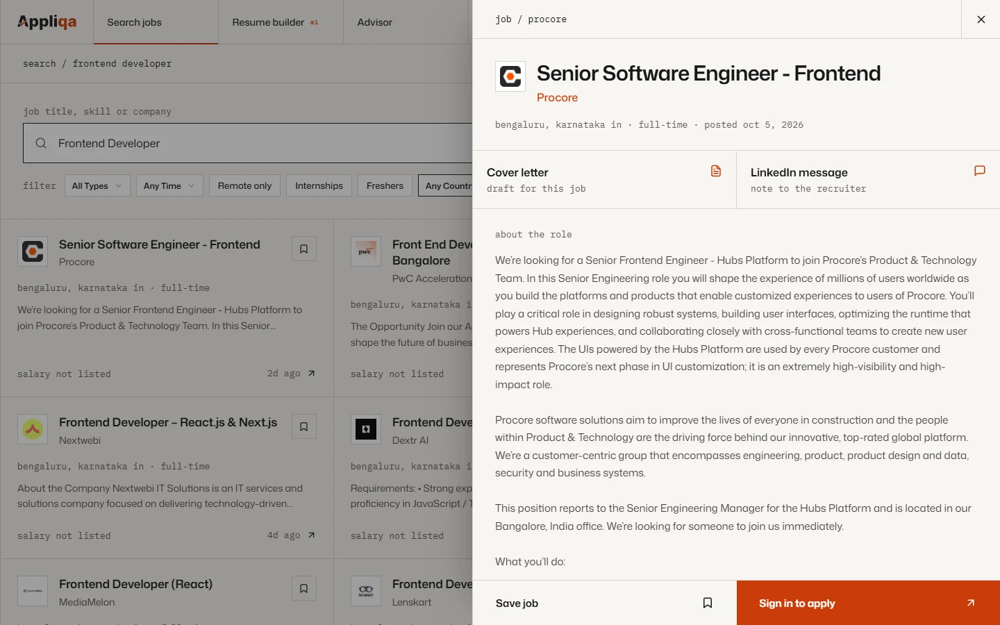
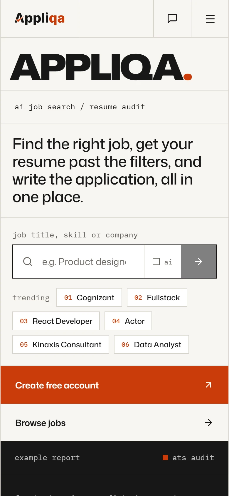
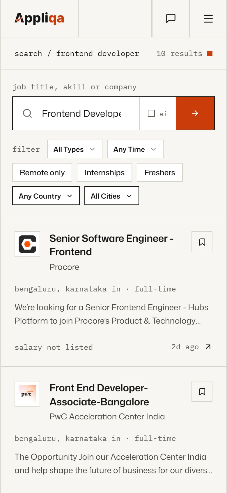
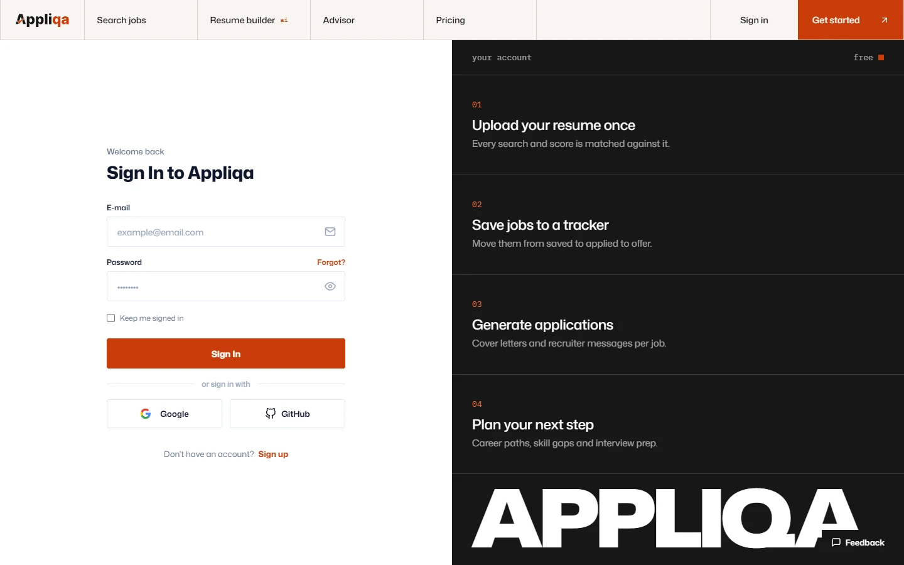
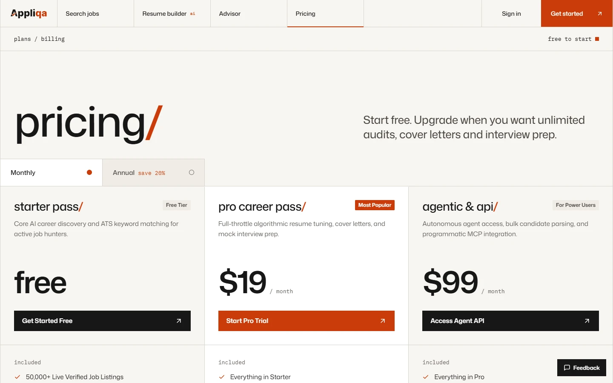
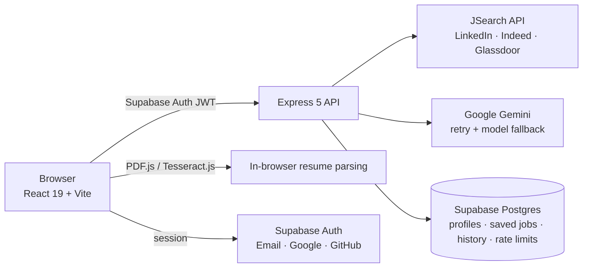

<p align="center">
  <a href="https://www.appliqa.xyz">
    
  </a>
</p>

<h3 align="center">Find the right job, get your resume past the filters, and write the application, all in one place.</h3>

<p align="center">
  <a href="https://www.appliqa.xyz"><b>Live site</b></a> ·
  <a href="#features">Features</a> ·
  <a href="#engineering-highlights">Engineering</a> ·
  <a href="#architecture">Architecture</a> ·
  <a href="#running-locally">Run locally</a>
</p>

<p align="center">
  
  
  
  
  
  
  
</p>

<p align="center">
  <a href="https://www.appliqa.xyz">
    
  </a>
</p>

## Why Appliqa

Job hunting is spread across too many tabs: one site to find roles, another to check if your resume will survive an ATS, a doc for cover letters, a spreadsheet to track it all. Appliqa puts the whole loop in one place. Search real listings, see how well your resume matches each one, fix the gaps, generate the application, and track it to an offer.

## Features

### Job search across the big boards

Live listings from LinkedIn, Indeed, Glassdoor and more, through the JSearch API.

- **Filters:** job type, date posted, remote only, internships, freshers, country and city.
- **AI search:** describe the job you want in plain English and let AI turn it into a search.
- **Personal history and trending searches:** recent searches load instantly when you come back, and junk queries are filtered out of trending.
- **One-click save:** save or unsave from the card or the detail panel; both stay in sync.

<table>
  <tr>
    <td width="50%"></td>
    <td width="50%"></td>
  </tr>
  <tr>
    <td align="center"><sub>Search with filters for type, recency, remote, internships, freshers and location</sub></td>
    <td align="center"><sub>Job detail: draft a cover letter or LinkedIn message for this exact role</sub></td>
  </tr>
</table>

### Resume intelligence

- **Reads resumes in the browser, without AI.** PDF.js extracts text and keeps line breaks, with a Tesseract.js OCR fallback for scanned files. Your resume is structured locally before any AI call.
- **ATS score:** keyword-by-keyword comparison against a job post, showing what's matched and what's missing.
- **AI match score** for every job, based on your resume.
- **Multiple named resumes** with one marked primary; searches and scores use the primary.
- **Skill suggestions** from the advisor can be added to your resume in one click.

### Resume builder

- **Design controls:** layout, section order, custom sections, and an optional photo.
- **Editors** for experience, projects (with live-demo and GitHub links) and achievements.
- **AI tools:** tailor a resume to a job, strengthen bullet points, and find achievements hidden in your experience.
- **Import** from a saved resume or the last file you uploaded.
- **Exports:**
  - a print-ready PDF that fits to one page, with page numbers only when it runs longer
  - **LaTeX:** copy it, download the `.tex`, or open it in Overleaf
  - **LaTeX round trip:** edit the LaTeX and apply the changes back into the builder

### Application tools

- **Cover letters** and **LinkedIn recruiter messages** written for a specific job.
- **Interview prep:** likely questions, model answers and tips for the role you're applying to.
- **Application tracker:** move jobs through **Saved → Applied → Interview → Offer / Rejected**, add jobs found elsewhere, and keep a cover letter with each application.

### Career planning

- **AI career advisor:** a chat mentor that knows your profile. It gives career guidance, critiques your resume and runs mock interviews, and conversations are saved.
- **Career path planner:** possible next roles with timelines and salary progression, shown as CTC with approximate monthly pay on hover.
- **Skills gap analysis:** what to learn next for the role you want.

### Works on phones too

<p align="center">
  
  &nbsp;&nbsp;
  
</p>

<p align="center">
  
  <br />
  <sub>Sign in with email, Google or GitHub (Supabase Auth)</sub>
</p>

<!-- Pricing is not live yet; restore this when paid plans launch.
<p align="center">
  
  <br />
  <sub>Pricing</sub>
</p>
-->

## Engineering highlights

- **Resilient AI layer:** Gemini calls retry on busy or overloaded models and fall back to a second model. The model list is configurable through `GEMINI_MODELS`, and a retired model is skipped automatically.
- **Rate limiting that works across instances:**
  - fixed-window limits, counted per user when signed in and per IP otherwise
  - counters live in a Postgres table, so every API instance shares them
  - only the service role can touch that table: Row Level Security is on with no policies
- **Safe errors:** API errors are mapped to clean messages, so internal details never leak to the client.
- **Fast first load:**
  - routes are lazy-loaded
  - vendor code is split into chunks by exact package name (React, Supabase, motion, charts)
  - fonts are self-hosted
  - the hero image is a 52 KB WebP preloaded for LCP
  - pages preload, so a nav switch lands on the first click
- **Privacy-friendly parsing:** resume text is extracted in the browser before anything is sent for AI analysis.
- **Accessibility:** an accessible brand colour, visible focus rings, keyboard-friendly side sheets and dropdowns, and route-level skeletons instead of layout jumps.
- **Machine-readable:** an `openapi.json` and `llms.txt` describe the product for agents and crawlers.

## Architecture



| Layer | Technology |
|---|---|
| Frontend | React 19, Vite, Tailwind CSS, React Router 7, Framer Motion, GSAP, Recharts |
| Resume parsing | PDF.js, Tesseract.js (OCR) |
| Backend | Node.js, Express 5 |
| Auth & database | Supabase (Postgres, Auth, Row Level Security) |
| AI | Google Gemini (Flash-Lite models with fallback) |
| Jobs data | JSearch via RapidAPI |
| Hosting | Vercel (web) |

## Running locally

**Prerequisites:** Node.js 18+, a Supabase project, a [JSearch](https://rapidapi.com/letscrape-6bRBa3QguO5/api/jsearch) key and a [Gemini](https://aistudio.google.com/apikey) key.

```bash
git clone https://github.com/imsayanpaul/Appliqa.git
cd Appliqa
```

**1. API server** (`.env` in the repo root)

```bash
RAPIDAPI_KEY=your_jsearch_key
GEMINI_API_KEY=your_gemini_key
SUPABASE_URL=your_supabase_url
SUPABASE_SERVICE_KEY=your_supabase_service_role_key
PORT=3001
```

```bash
npm install --prefix server
node --env-file=.env server/index.js
```

**2. Web client** (`client/.env`)

```bash
VITE_SUPABASE_URL=your_supabase_url
VITE_SUPABASE_ANON_KEY=your_supabase_anon_key
VITE_API_BASE=http://localhost:3001/api
```

```bash
cd client && npm install && npm run dev
```

Open http://localhost:5173.

## Project structure

```
Appliqa/
├── client/                    # React app (Vite)
│   └── src/
│       ├── pages/             # Home, Search, Tracker, Resume builder, Advisor, Career path, Profile
│       ├── components/        # Job cards & detail, ATS scorer, interview prep, onboarding, resume/*
│       ├── lib/               # Resume parsing, LaTeX import/export, resume design, profiles
│       └── services/          # API client
├── server/                    # Express API
│   ├── routes/                # jobs, ai, user
│   ├── middleware/            # auth, rate limiting
│   └── lib/                   # Gemini client with fallback, Supabase, error mapping
└── supabase/migrations/       # Database migrations
```

## License

**Proprietary. All rights reserved.** © 2026 Sayan Paul.

The code is public so it can be viewed and evaluated, for example by recruiters. It is not open source: copying, reusing, modifying, redistributing or deploying any part of Appliqa is not allowed without written permission. See [LICENSE](LICENSE) for the full terms.
